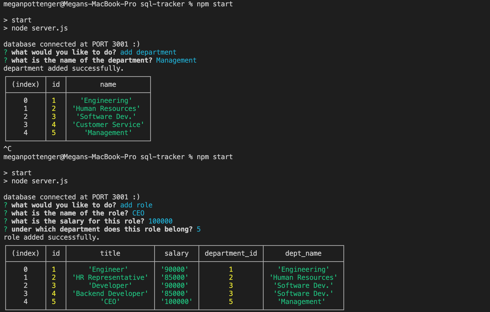

# SQL Employee Tracker

## Table of Contents
### -[Links](#links)
### -[Installation](#installation)
### -[Technologies](#technologies)
### -[Questions](#questions)
### -[Licensing](#license)

## Links
A screenshot of the final project:

## Screencastify tutorial:

https://drive.google.com/file/d/11nDN0Pnw8JIlp_4gk7xFv-6-PCJS1exy/view

## Description
The SQL Employee Tracker is a content management system (CMS) that is able to track departments, roles, and employees. By invoking the startPrompt() function using 'npm start,' a user has the option of viewing certain tables (department, role, or employee), or adding a new row to each of these tables. They are also able to update the employee list, by changing the employee's role. When creating this project, I wanted to ensure the modularization of the code, so I gave each table its own file of necessary functions and questions, to ease some of the heft off of the server.js file. 

When the question array is called with startPrompt(), the user is given options to select: they can add to each of these tables, or view them, or update the employee's role. For adding to each table (department, role, employee), the user is prompted with table-specific questions from their own arrays, which can be found in the table-specific route file. The user's responses are inserted into the chosen table, and it is displayed in the console. If the user chooses to view any of these departments, a select query is called to show these tables, also in the console. Should the user decide to update, they are prompted to enter the employee's id number, as well as the role id number that they wish to assign to that employee. Functionality for employee updating can be found in the employeeRoutes.js file, alongside the functions to view the employees table or insert a new row to that table.
  
## Installation
### Instructions for Project Installation:
Please run 'npm i' to ensure that each package is installed correctly. This project uses the MySQL2, Inquirer, and console table packages.
  
## Technologies
### Built With:
Javascript, MySQL; also uses MySQL2, Inquirer, and console table packages.
  
## Questions
### Please reach out with any questions or concerns!
Github: https://github.com/mtpott

Email: mtpott23@gmail.com